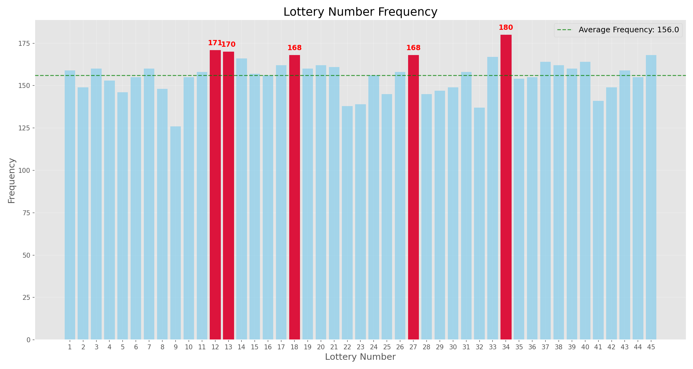

# RTX 4060에 최적화된 LSTM 로또 번호 예측 시스템



## 개요

이 프로젝트는 딥러닝 LSTM(Long Short-Term Memory) 모델을 사용하여 로또 번호를 예측하는 시스템입니다. RTX 4060 GPU에 최적화되었으며, 과거 당첨 번호 데이터의 패턴을 학습하여 다음 회차에 나올 가능성이 높은 번호를 예측합니다.

## 주요 기능

1. **RTX 4060에 최적화된 LSTM 신경망**
   - 양방향 LSTM 레이어 사용
   - 배치 정규화 및 드롭아웃 적용
   - 혼합 정밀도 학습(FP16) 지원
   - XLA 컴파일러 활성화

2. **다양한 예측 방법론**
   - LSTM 모델 기반 예측
   - 앙상블 예측 기법 적용
   - 빈도 분석 기반 예측
   - 최근 패턴 기반 예측
   - 통계적 균형 예측

3. **고급 데이터 분석**
   - 번호별 출현 빈도 분석
   - 홀수/짝수 분포 패턴
   - 번호 범위 분석
   - 연속 번호 패턴 분석

4. **데이터 시각화**
   - 번호 출현 빈도 차트
   - 최근 회차 히트맵
   - 홀수/짝수 분포 파이 차트
   - 번호 범위 분포 차트

5. **성능 최적화**
   - TensorFlow 데이터 파이프라인 최적화
   - GPU 메모리 관리
   - 배치 처리 최적화

## 시스템 구성

본 시스템은 모듈화된 구조로 구성되어 있어 유지보수와 확장이 용이합니다:

```
lotto-prediction/
│
├── main.py                 # 메인 실행 파일
├── data_loader.py          # 데이터 로딩 및 전처리
├── model.py                # LSTM 모델 정의 및 학습
├── analysis.py             # 로또 번호 패턴 분석
├── visualization.py        # 데이터 시각화
├── utils.py                # 유틸리티 함수
├── predict.py              # 학습된 모델로 예측하기
│
├── requirements.txt        # 필수 라이브러리 목록
├── README.md               # 프로젝트 설명서
│
├── models/                 # 저장된 모델 파일 (자동 생성)
├── logs/                   # 로그 파일 (자동 생성)
└── visualization/          # 생성된 시각화 파일 (자동 생성)
```

## 설치 방법

### 필수 요구사항

- Python 3.8 이상
- NVIDIA GPU (RTX 4060 이상 권장)
- CUDA 11.8 이상
- cuDNN 8.6 이상

### 환경 설정

```bash
# 1. 가상 환경 생성 및 활성화
conda create -n lotto_rtx python=3.8 -y
conda activate lotto_rtx

# 2. 필수 패키지 설치
pip install -r requirements.txt

# 3. CUDA 및 cuDNN 설치 (RTX 4060 사용 시)
conda install -c conda-forge cudatoolkit=11.8 cudnn=8.6.0
```

## 사용 방법

### 1. 데이터 준비

로또 데이터를 `lotto.xlsx` 파일로 준비합니다. 파일은 다음 형식을 따라야 합니다:
- '회차', '번호1', '번호2', '번호3', '번호4', '번호5', '번호6', '보너스' 등의 열 포함
- 최신 회차가 파일의 앞쪽에 위치 (내림차순 정렬)

### 2. 모델 학습 및 예측

기본 설정으로 실행:

```bash
python main.py
```

추가 옵션 사용:

```bash
python main.py --file lotto.xlsx --sequence 10 --epochs 300 --batch-size 64 --visualize
```

### 3. 저장된 모델로 예측만 하기

```bash
python predict.py --model models/lotto_lstm_model.h5 --file lotto.xlsx
```

### 4. 명령행 옵션

| 옵션 | 설명 | 기본값 |
|------|------|--------|
| `--file` | 로또 데이터 파일 경로 | lotto.xlsx |
| `--sequence` | 예측에 사용할 이전 회차 수 | 10 |
| `--epochs` | 학습 에포크 수 | 300 |
| `--batch-size` | 배치 크기 | 64 |
| `--visualize` | 데이터 시각화 생성 | 활성화 |
| `--no-visualize` | 시각화 비활성화 | - |
| `--verbose` | 상세 로그 출력 | 비활성화 |
| `--load-model` | 저장된 모델 파일 경로 | None |
| `--monitor-gpu` | GPU 사용량 모니터링 활성화 | 비활성화 |

## 모델 구조

본 시스템은 다음과 같은 최적화된 LSTM 모델 구조를 사용합니다:

```
Model: "LottoPredictor"
_________________________________________________________________
Layer (type)                 Output Shape              Param #   
=================================================================
bidirectional_lstm_1        (None, 10, 384)           379392    
_________________________________________________________________
batch_norm_1                (None, 10, 384)           1536      
_________________________________________________________________
dropout_1                   (None, 10, 384)           0         
_________________________________________________________________
bidirectional_lstm_2        (None, 256)               524288    
_________________________________________________________________
batch_norm_2                (None, 256)               1024      
_________________________________________________________________
dropout_2                   (None, 256)               0         
_________________________________________________________________
dense_1                     (None, 96)                24672     
_________________________________________________________________
batch_norm_3                (None, 96)                384       
_________________________________________________________________
dropout_3                   (None, 96)                0         
_________________________________________________________________
output                      (None, 6)                 582       
=================================================================
Total params: 931,878
Trainable params: 930,406
Non-trainable params: 1,472
_________________________________________________________________
```

## 성능 최적화

RTX 4060 GPU에 대한 최적화 기법:

1. **혼합 정밀도 학습**: FP16 계산을 사용하여 메모리 사용량 감소 및 계산 속도 향상
2. **XLA(Accelerated Linear Algebra) 컴파일러**: TensorFlow 연산 최적화
3. **메모리 증가 설정**: 필요에 따라 메모리 할당을 최적화하여 OOM(Out of Memory) 오류 방지
4. **배치 정규화**: 그래디언트 소실 문제 완화 및 학습 안정성 향상
5. **최적화된 데이터 파이프라인**: tf.data API를 사용한 데이터 로딩 및 전처리 최적화

## 앙상블 예측 방법

시스템은 다음 4가지 예측 방법을 결합한 앙상블 기법을 사용합니다:

1. **LSTM 모델 예측** (40% 가중치): 신경망 기반 예측
2. **빈도 기반 예측** (20% 가중치): 과거 가장 자주 등장한 번호 활용
3. **최근 패턴 기반 예측** (20% 가중치): 최근 회차 분석 기반
4. **통계적 균형 예측** (20% 가중치): 홀짝 및 번호 범위 균형 고려

## 주의 사항

- 이 모델은 학습 목적으로 만들어진 것으로, 실제 당첨을 보장하지 않습니다.
- 로또는 본질적으로 무작위 추첨 방식이므로, 과거 데이터에서 의미 있는 패턴을 찾기 어려울 수 있습니다.
- 모델의 예측 결과는 참고용으로만 사용하시기 바랍니다.
- 책임감 있는 복권 구매를 권장합니다.

## 기술 스택

- **Python 3.8+**: 주 프로그래밍 언어
- **TensorFlow 2.6+**: 딥러닝 프레임워크
- **NumPy, Pandas**: 데이터 처리
- **Matplotlib**: 데이터 시각화
- **scikit-learn**: 데이터 전처리 및 분석
- **CUDA 11.8+, cuDNN 8.6+**: GPU 가속

**알림**: 본 프로젝트는 교육 및 학습 목적으로 제작되었습니다. 실제 로또 당첨에 대한 어떠한 보장도 하지 않습니다.