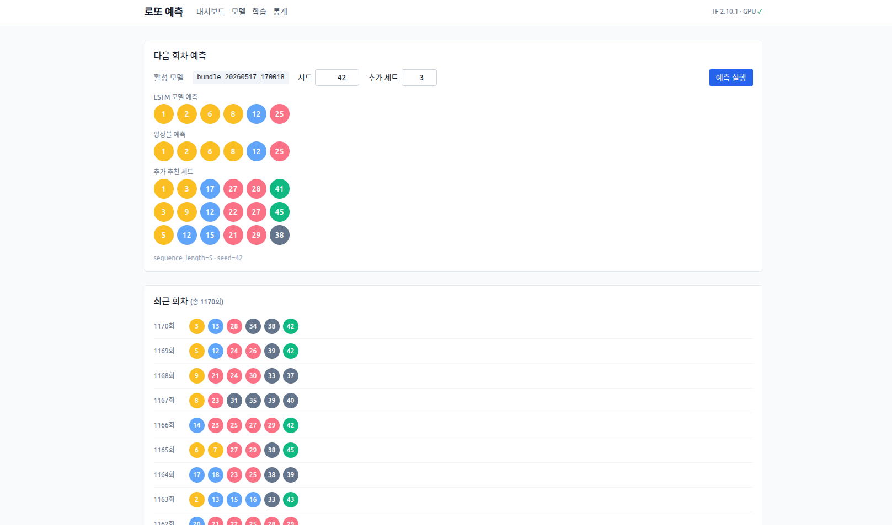

# Lotto Prediction — LSTM + Ensemble + Vue 3 SPA

> **RTX 4060** 에 최적화된 양방향 LSTM 과 통계 기반 앙상블로 다음 회차 번호를 추정하고, FastAPI 와 Vue 3 SPA 로 학습/예측/탐색을 한 화면에서 다루는 **단일 사용자 로컬 도구**입니다.



> ⚠ 로또 추첨은 i.i.d. 무작위 사건입니다. 본 시스템의 "예측" 은 과거 데이터의 통계적 패턴 학습 결과일 뿐이며 다음 회차 당첨 확률을 변화시키지 않습니다. `backend/evaluate.py` 의 **랜덤 베이스라인 비교**가 이 한계를 정량적으로 드러냅니다.

---

## 목차

- [구성요소](#구성요소)
- [디렉토리 구조](#디렉토리-구조)
- [요구사항](#요구사항)
- [빠른 시작](#빠른-시작)
- [API 서버](#api-서버)
- [Frontend (Vue 3 + Vite + Tailwind)](#frontend-vue-3--vite--tailwind)
- [CLI 도구](#cli-도구)
- [모델 구조](#모델-구조)
- [앙상블 예측](#앙상블-예측)
- [학습 산출물 (Bundle)](#학습-산출물-bundle)
- [테스트](#테스트)
- [성능 최적화 노트](#성능-최적화-노트)
- [통계적 한계와 책임 있는 사용](#통계적-한계와-책임-있는-사용)
- [추가 문서](#추가-문서)
- [라이선스](#라이선스)

---

## 구성요소

| 계층 | 기술 | 위치 |
|---|---|---|
| ML 코어 | Python 3.10 · TensorFlow 2.x · scikit-learn · NumPy · pandas · matplotlib | `backend/` (분석/모델/유틸/CLI) |
| API 서버 | FastAPI · uvicorn · Pydantic | `backend/app/` |
| SPA | Vue 3.4 · Vite 5 · Tailwind 3.4 · Pinia · Vue Router · TypeScript · axios · Chart.js | `frontend/` |
| 테스트 | pytest · Vitest | `backend/tests/`, `frontend/src/**/__tests__/` |

세부 아키텍처와 UML 은 [`docs/architecture.md`](docs/architecture.md), [`docs/uml.md`](docs/uml.md) 참고.

---

## 디렉토리 구조

```
lotto-prediction/
├── backend/
│   ├── app/                    # FastAPI 애플리케이션
│   │   ├── main.py             #   factory + lifespan (Data/Model/Training Store 단일 인스턴스)
│   │   ├── config.py           #   Settings (host/port/CORS, env-driven)
│   │   ├── deps.py             #   FastAPI Depends
│   │   ├── schemas.py          #   Pydantic 응답/요청 (한국어 컬럼 → 영어 키 변환)
│   │   ├── routers/            #   /api/health · /draws · /models · /predict · /train
│   │   └── services/           #   DataStore · ModelStore · TrainingService · prediction
│   ├── tests/                  # pytest (순수 헬퍼 + 평가 베이스라인)
│   ├── analysis.py             # 패턴 분석 + 앙상블 투표
│   ├── data_loader.py          # 엑셀 로드 + 시퀀스 전처리 + tf.data 파이프라인
│   ├── model.py                # LSTM 빌더/학습/추론 + TFLite 양자화
│   ├── predict.py              # CLI 예측 (번들 또는 단일 모델 입력)
│   ├── evaluate.py             # 워크포워드 백테스트 + 랜덤 베이스라인
│   ├── visualization.py        # matplotlib 시각화
│   ├── utils.py                # 번들 저장/로드 · 시드 · GPU · 데이터 SHA-256
│   ├── constants.py            # NUM_BALLS=6, MIN=1, MAX=45, 컬럼명
│   ├── paths.py                # backend/ 기준 절대경로 상수
│   ├── env_setup.py            # TF 결정성 환경변수 (TF import 이전 호출)
│   ├── run_api.py              # uvicorn 진입 (env_setup → import → run)
│   ├── main.py                 # CLI 학습/예측 진입
│   ├── lotto.xlsx              # 학습 데이터
│   ├── requirements.txt
│   └── models/                 # bundle_<ts>/{model.keras|h5, scaler.pkl, meta.json}
│                               # + active.json (마지막 활성 번들 영속화)
├── frontend/
│   ├── src/
│   │   ├── api/client.ts       # axios + 백엔드 스키마 1:1 TypeScript 타입
│   │   ├── stores/app.ts       # Pinia: health/models/predict/training 상태
│   │   ├── router/index.ts     # /, /models, /train, /stats
│   │   ├── views/              # DashboardView · ModelsView · TrainView · StatsView
│   │   ├── components/         # NumberBalls 등
│   │   ├── App.vue · main.ts
│   │   └── assets/main.css     # Tailwind entry
│   └── vite.config.ts · tailwind.config.js · vitest.config.ts
├── docs/
│   ├── architecture.md         # 계층 모델 · 컴포넌트 · 시나리오 · 트레이드오프
│   └── uml.md                  # Mermaid 다이어그램 (컨텍스트/클래스/시퀀스/상태/플로우)
├── demo.png
├── LICENSE
└── README.md                   # 본 파일
```

---

## 요구사항

- **Python 3.10** (TensorFlow 2.x 와 호환되는 버전)
- **Node.js 18 LTS** 이상 (Vite 5)
- 권장: NVIDIA GPU (RTX 4060 이상) + CUDA 11.8 / cuDNN 8.6 — CPU 로도 동작은 가능

---

## 빠른 시작

### 1) 백엔드 의존성 설치

```bash
cd backend
python -m venv .venv && source .venv/bin/activate     # 또는 conda
pip install -r requirements.txt
```

### 2) API 서버 기동

```bash
# backend/ 에서
python run_api.py     # http://127.0.0.1:8000  (Swagger UI: /docs)
```

### 3) 프런트엔드 dev 서버

```bash
cd frontend
npm install
npm run dev           # http://127.0.0.1:5173  (/api → 127.0.0.1:8000 프록시)
```

활성 모델이 없으면 대시보드가 안내합니다. 번들이 하나도 없다면 `/train` 페이지에서 학습을 시작하거나, CLI 로 `cd backend && python main.py` 를 한 번 실행하세요 — `backend/models/bundle_<ts>/` 가 자동 생성되어 UI 에서 활성화 가능합니다.

---

## API 서버

`backend/run_api.py` 가 **반드시** `env_setup.set_deterministic_env()` 를 TF import 이전에 호출하여 `TF_DETERMINISTIC_OPS=1` / `TF_CUDNN_DETERMINISTIC=1` 을 세팅합니다.

### 환경 변수

| 변수 | 기본값 | 설명 |
|---|---|---|
| `LOTTO_API_HOST` | `127.0.0.1` | 바인딩 호스트. **LAN 노출은 `0.0.0.0` 으로 명시할 때만**. |
| `LOTTO_API_PORT` | `8000` | 포트 |
| `LOTTO_API_CORS_ORIGINS` | `http://localhost:5173,http://127.0.0.1:5173` | 콤마 구분 CORS 화이트리스트 |

### 주요 엔드포인트 (V1)

| Method | Path | 설명 |
|---|---|---|
| `GET`  | `/api/health` | 상태 / TF 버전 / GPU 가용성 |
| `GET`  | `/api/draws/recent?limit=20` | 최근 회차 (`limit ≤ 200`) |
| `GET`  | `/api/draws/stats` | 빈도 / 홀짝 / 구간 통계 |
| `GET`  | `/api/models` | 학습 번들 목록 + `is_active` / `data_hash_match` 플래그 |
| `POST` | `/api/models/active` | 활성 번들 변경 — `{ "name": "bundle_..." }` |
| `POST` | `/api/predict` | 활성 모델로 다음 회차 예측 (학습 중에는 `409`) |
| `POST` | `/api/train` | 학습 잡 제출 — `{ epochs, batch_size, sequence_length, seed, auto_activate }` |
| `GET`  | `/api/train` | 잡 목록 + 현재 진행 중인 잡 ID |
| `GET`  | `/api/train/{job_id}` | 잡 상태/진행률 |

> 활성 번들의 학습 시점 데이터 SHA-256 (`meta.data_sha256`) 이 현재 `lotto.xlsx` 의 해시와 다르면 응답의 `data_hash_match: false` 로 표시됩니다. UI 에서 경고 배지로 노출됩니다.

### 동시성 정책

- 학습은 `ThreadPoolExecutor(max_workers=1)` 로 **직렬화**. 두 번째 동시 제출은 `409 Conflict`.
- 학습 진행 중 `/api/predict` 도 `409` — GPU 메모리 충돌 회피.
- 모델 교체 시 기존 참조를 `None` 으로 떨군 뒤 `tf.keras.backend.clear_session() → gc.collect()` 순서로 자원 해제.

---

## Frontend (Vue 3 + Vite + Tailwind)

```bash
cd frontend
npm install
npm run dev           # 개발 (Vite, /api 프록시)
npm run build         # 프로덕션 빌드 → frontend/dist/
npm test              # Vitest 1회
npm run test:watch    # watch 모드
```

| 경로 | 설명 |
|---|---|
| `/`        | **대시보드** — 활성 모델로 예측 실행 + 최근 회차 목록 |
| `/models`  | **모델** — 학습 번들 목록 + 활성화 + 데이터 해시 매치 배지 |
| `/train`   | **학습** — API 로 새 모델 학습 트리거 + 진행률 폴링 (1.5s) + 완료 시 자동 활성화 |
| `/stats`   | **통계** — `/api/draws/stats` 기반 빈도/홀짝/구간 차트 (Chart.js) |

`stores/app.ts` (Pinia) 가 `health` / `models` / `recentDraws` / `latestPrediction` / `stats` / `trainingJob` 상태를 보유. 학습 잡은 `setTimeout` 폴링으로 진행률을 갱신하고, 완료 시 모델 목록을 새로고침해 활성화 상태를 동기화합니다.

빌드된 정적 파일을 FastAPI 가 직접 서빙하면 CORS 자체가 사라집니다 (배포 시 권장).

---

## CLI 도구

API 와 CLI 는 동일한 ML 코어(`analysis` · `model` · `data_loader` · `utils`)를 공유합니다.

### `main.py` — 학습 + 예측

```bash
cd backend
python main.py                                           # 기본값
python main.py --file lotto.xlsx --sequence 10 \
               --epochs 300 --batch-size 64 --seed 42
```

| 옵션 | 설명 | 기본값 |
|---|---|---|
| `--file` | 로또 데이터 파일 경로 | `lotto.xlsx` |
| `--sequence` | 예측에 사용할 이전 회차 수 | `10` |
| `--epochs` | 최대 학습 에포크 | `300` |
| `--batch-size` | 배치 크기 | `64` |
| `--seed` | 재현성 시드 | `42` |
| `--visualize` / `--no-visualize` | 데이터 시각화 생성 | 활성화 |
| `--verbose` | 상세 로그 | off |
| `--load-model` | 저장된 모델 파일 경로 | `None` |
| `--monitor-gpu` | GPU 사용량 모니터링 | off |

### `predict.py` — 저장된 모델로 예측만

```bash
python predict.py --model models/bundle_<ts>/model.keras \
                  --scaler models/bundle_<ts>/scaler.pkl \
                  --file lotto.xlsx
```

| 옵션 | 설명 | 기본값 |
|---|---|---|
| `--model` | 학습된 모델 파일 (**필수**) | - |
| `--scaler` | 스케일러 `.pkl` (**필수**) | - |
| `--file` | 데이터 파일 | `lotto.xlsx` |
| `--sequence` | 이전 회차 수 | `10` |
| `--num-sets` | 추가 추천 세트 수 | `3` |
| `--seed` | 시드 | `42` |
| `--visualize` | 시각화 생성 | off |
| `--gpu` / `--no-gpu` | GPU 최적화 | on |
| `--monitor-gpu` | GPU 모니터링 | off |

### `evaluate.py` — 워크포워드 백테스트

```bash
python evaluate.py --test-size 50 --epochs 100
```

랜덤 베이스라인과 모델의 일치 개수 분포를 나란히 출력합니다. 두 분포가 통계적으로 유의미하게 다르지 않다면 모델은 추첨 결과에 대한 예측력이 없는 것입니다 (대부분의 경우 그렇습니다 — 정상입니다).

> CLI 사용 시 **반드시 `cd backend`** 한 뒤 실행하세요. `backend/paths.py` 가 모든 산출물(`models/`, `logs/`, `visualization/`) 위치를 `backend/` 기준 절대경로로 고정합니다.

---

## 모델 구조

```
Model: "LottoPredictor"
─────────────────────────────────────────────────────────────────
 Layer (type)                Output Shape              Param #
═════════════════════════════════════════════════════════════════
 bidirectional_lstm_1        (None, 10, 384)           305,664
 batch_norm_1                (None, 10, 384)           1,536
 dropout_1                   (None, 10, 384)           0
 bidirectional_lstm_2        (None, 256)               525,312
 batch_norm_2                (None, 256)               1,024
 dropout_2                   (None, 256)               0
 dense_1                     (None, 96)                24,672
 batch_norm_3                (None, 96)                384
 dropout_3                   (None, 96)                0
 output (dtype=float32)      (None, 6)                 582
═════════════════════════════════════════════════════════════════
Total params:        859,174
Trainable params:    857,702
Non-trainable params:  1,472
```

- 출력층만 `float32` 로 고정해 `mixed_float16` 정책에서의 수치 안정성을 확보.
- `EarlyStopping(patience=30, restore_best_weights=True)` · `ReduceLROnPlateau(factor=0.5, patience=10)` · `TensorBoard` 콜백.
- 시계열 검증 split — 마지막 20% 를 val 로 사용 (shuffle 금지).
- `predict_next_numbers()` 는 위치별 예측을 보존하되 중복 시 *가장 가까운 미사용 번호*로 결정적으로 재할당 (입력 → 출력 결정성 보장).

---

## 앙상블 예측

네 채널의 가중 투표로 최종 6 개 번호를 선정합니다.

| 채널 | 가중치 | 설명 |
|---|---:|---|
| LSTM 모델 예측 | **0.4** | 신경망 기반 |
| 빈도 기반 예측 | 0.2 | 출현 빈도 상위 15 개에서 샘플링 |
| 최근 패턴 기반 예측 | 0.2 | `analyze_number_trends` 의 상승 추세 번호 |
| 통계적 균형 예측 | 0.2 | 홀짝 / 5 구간 균형 |

---

## 학습 산출물 (Bundle)

학습 완료 시 다음 구조로 한 디렉토리에 묶여 저장됩니다.

```
backend/models/
├── active.json                     # {"bundle_name": "bundle_..."}
└── bundle_<YYYYmmdd_HHMMSS>/
    ├── model.keras                 # TF<2.13 이면 model.h5 로 폴백
    ├── scaler.pkl                  # MinMaxScaler (sklearn pickle)
    └── meta.json                   # {
                                    #   schema_version, timestamp,
                                    #   model_file, scaler_file,
                                    #   data_file, data_sha256,
                                    #   sequence_length, seed,
                                    #   tensorflow_version, sklearn_version, numpy_version,
                                    #   epochs?, batch_size?, best_val_loss?, trained_via?
                                    # }
```

- `data_sha256` 으로 학습 시점 데이터의 fingerprint 를 남겨, 이후 `lotto.xlsx` 가 바뀌면 UI 가 "stale 모델" 배지를 띄웁니다.
- `ModelStore.activate(name)` 은 `MODELS_DIR` 직계 자식만 허용해 경로 traversal 을 차단합니다.

---

## 테스트

### Backend (pytest)

```bash
cd backend
python -m pytest tests/ -v
```

순수 헬퍼(`validate_lotto_numbers`, `compare_predictions`, `_sha256_file`, `data_hash_matches`, `suggest_balanced_numbers`, `_random_baseline_matches`) 위주의 단위 테스트가 포함되어 있습니다. `utils` import 시 TF 가 로드되므로 첫 컬렉션에 ~1초 비용이 발생합니다.

### Frontend (Vitest)

```bash
cd frontend
npm test               # 1회
npm run test:watch     # watch
```

`NumberBalls` 색상 매핑, `asApiError` 파서 등의 단위 테스트가 포함되어 있습니다.

---

## 성능 최적화 노트

RTX 4060 기준으로 다음 항목이 적용되어 있습니다.

1. **혼합 정밀도 학습 (`mixed_float16`)** — 메모리 사용량 감소 + 계산 속도 향상. 출력층만 `float32` 로 명시.
2. **XLA JIT** — `tf.config.optimizer.set_jit(True)`.
3. **메모리 증가 설정** — `set_memory_growth(True)` 로 OOM 회피.
4. **`tf.data` 파이프라인** — `cache → shuffle(seed) → batch → prefetch(AUTOTUNE)`. 학습 셔플은 결정성 위해 `seed=` 명시.
5. **RTX 40 시리즈 스레딩** — CPU 코어 수 기반 `inter_op` / `intra_op` 동적 설정.
6. **전역 시드 관리** — `set_global_seeds()` 가 `random` / `numpy` / `tf` 시드를 일괄 세팅. 완전한 결정성에는 셸에서 `PYTHONHASHSEED=0 python ...` 도 필요.

---

## 통계적 한계와 책임 있는 사용

### 본질적 한계

로또 추첨은 i.i.d. 무작위 사건이므로 **이론적으로 어떤 모델도 추첨 결과를 예측할 수 있는 신호를 가질 수 없습니다.** 본 시스템이 출력하는 "예측" 은 과거 데이터의 통계적 패턴 학습 결과일 뿐, 다음 회차 당첨 확률을 변화시키지 않습니다.

### 이론값

- 1게임 3개 이상 일치 확률 ≈ **1.8%**
- 1게임 6개 모두 일치 확률 = 1 / 8,145,060 ≈ 0.0000123%

`evaluate.py` 의 워크포워드 백테스트는 **랜덤 베이스라인과 모델의 일치 개수 분포를 나란히 출력**합니다. 두 분포가 통계적으로 유의미하게 다르지 않다면 모델은 예측력이 없는 것입니다.

### 사용 시 유의

- 본 도구는 **학습 및 교육 목적**입니다. 실제 당첨을 보장하지 않습니다.
- 예측 결과는 참고용으로만 활용하세요.
- 책임감 있는 복권 구매를 권장합니다.

---

## 추가 문서

- [`docs/architecture.md`](docs/architecture.md) — 계층 모델, 컴포넌트 책임, 핵심 시나리오(부팅·예측·학습·활성화), 동시성/보안, 확장 시 trade-off
- [`docs/uml.md`](docs/uml.md) — Mermaid 다이어그램 모음 (컨텍스트 / 컴포넌트 / 클래스 / 시퀀스 / 상태 / 데이터 플로우)

---

## 라이선스

`LICENSE` 파일 참고.
