# UML 다이어그램

> 모든 다이어그램은 [Mermaid](https://mermaid.js.org/) 문법으로 작성되었습니다. GitHub/GitLab/대부분의 마크다운 뷰어에서 바로 렌더링됩니다.

## 1. 컨텍스트 / 컴포넌트 다이어그램 (C4-Light)

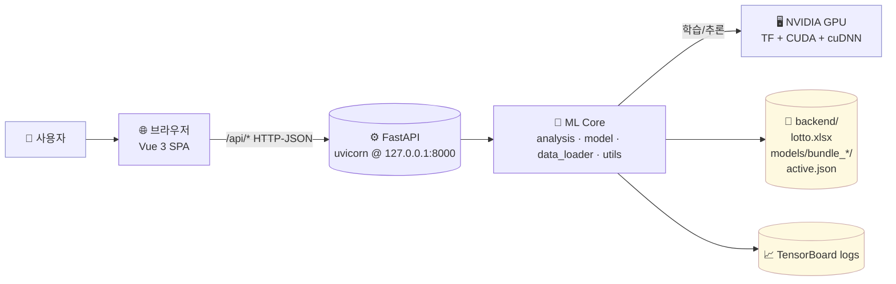

## 2. 백엔드 컴포넌트 구조

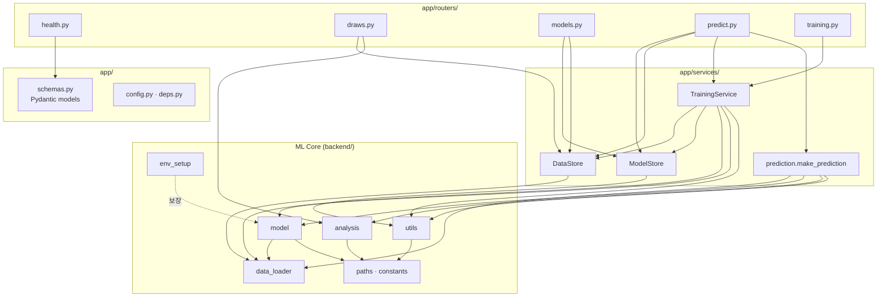

## 3. 클래스 다이어그램 (Backend Service Layer)

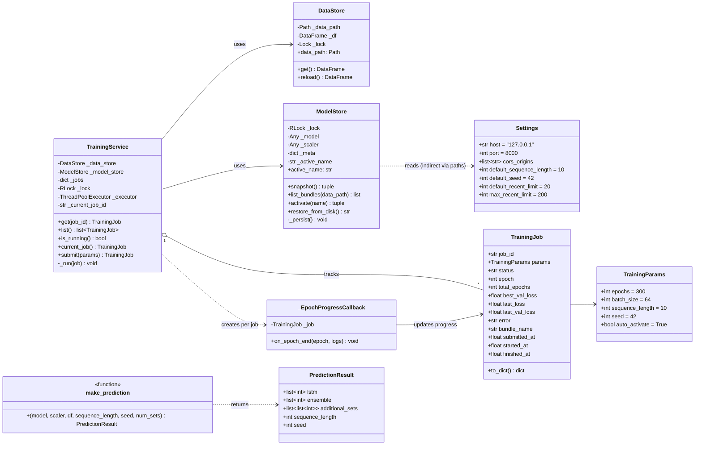

## 4. 클래스 다이어그램 (ML 코어 핵심 함수)

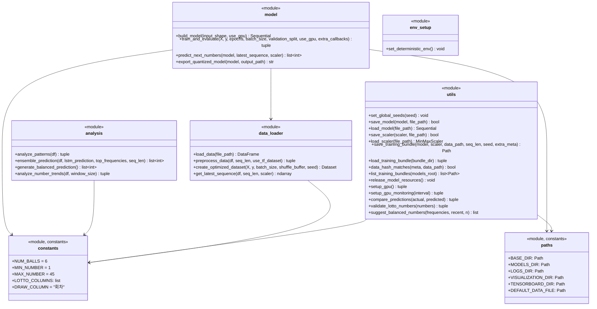

## 5. 시퀀스 — 예측 (`POST /api/predict`)

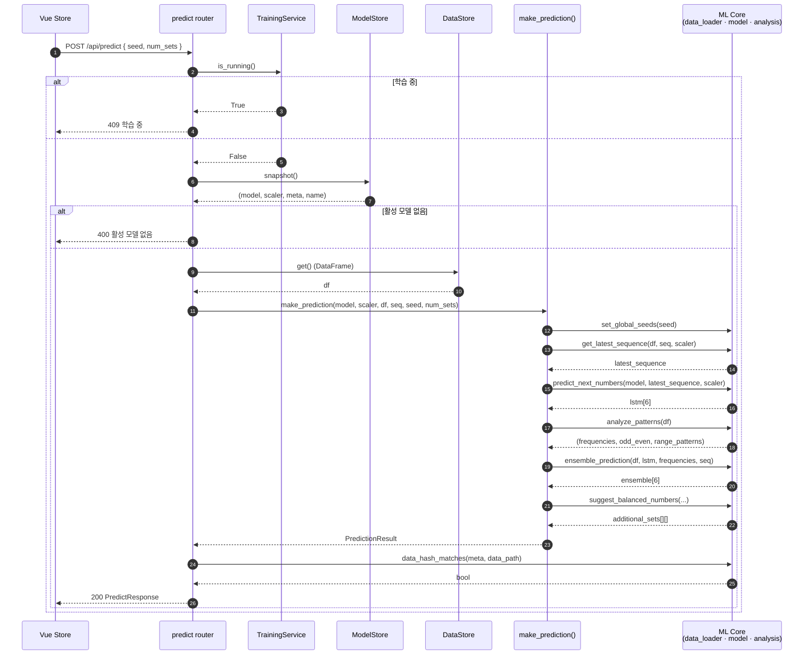

## 6. 시퀀스 — 학습 (`POST /api/train`)

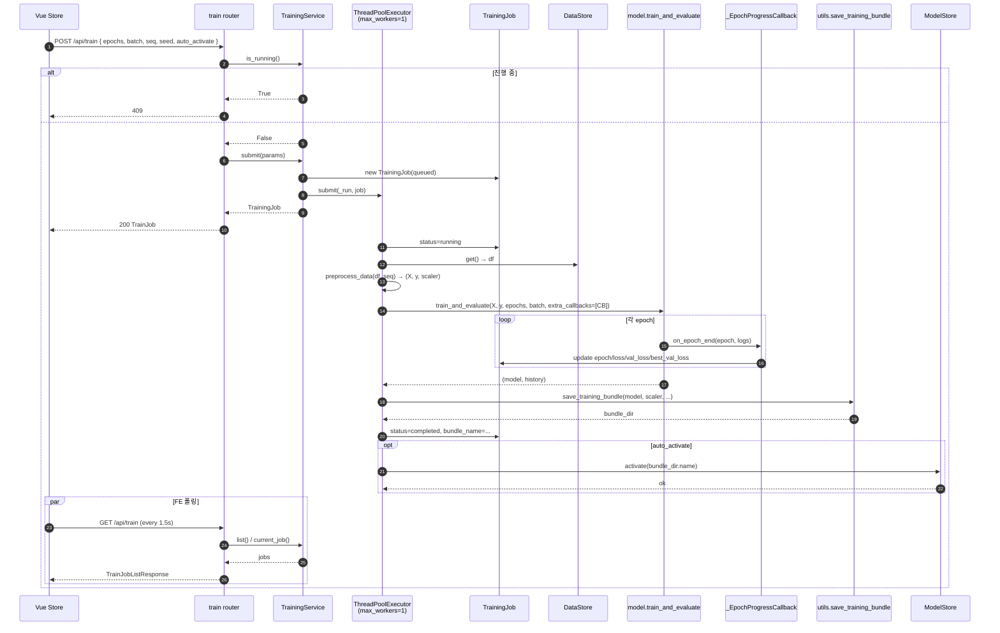

## 7. 시퀀스 — 모델 활성화 (`POST /api/models/active`)

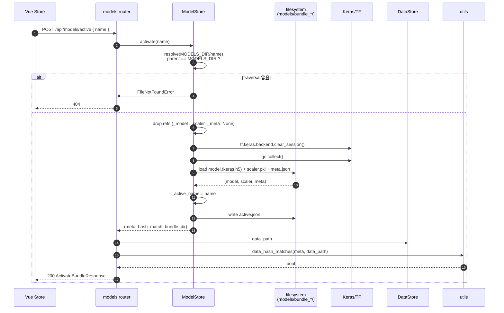

## 8. 시퀀스 — 부팅 (lifespan)

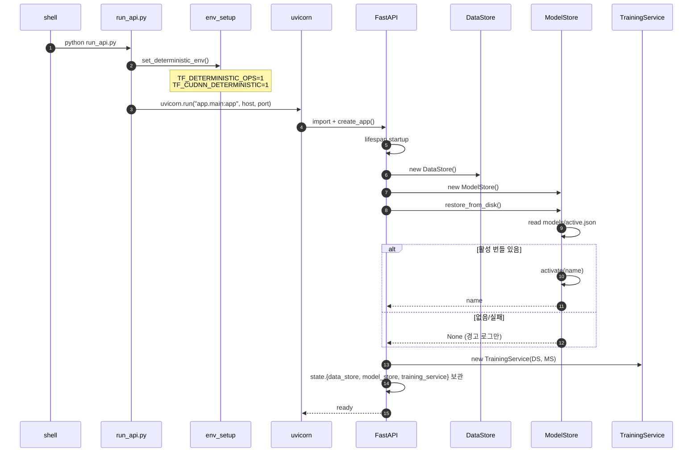

## 9. 상태 다이어그램 — TrainingJob

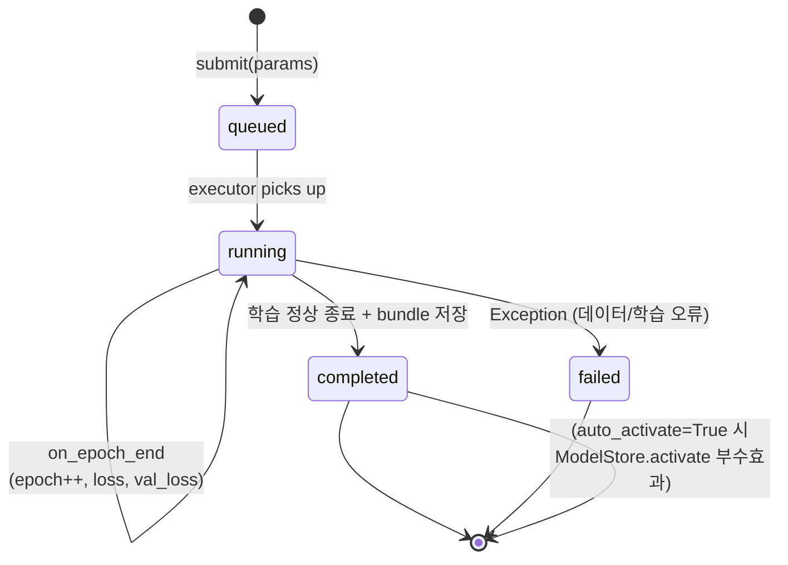

## 10. 상태 다이어그램 — ModelStore

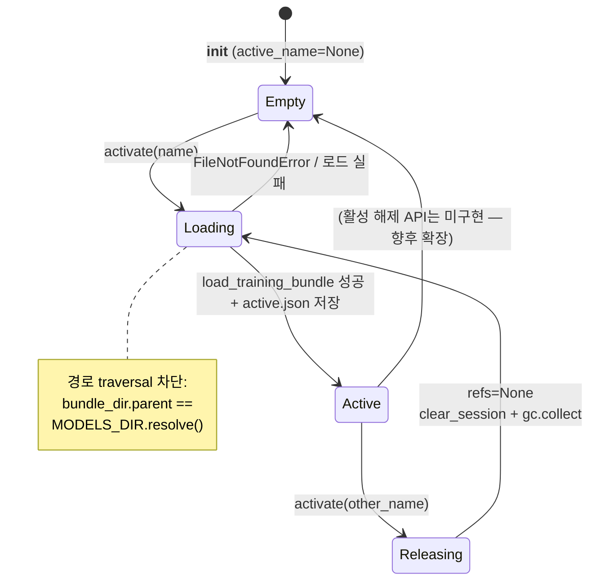

## 11. 데이터 흐름 — 학습 데이터 파이프라인

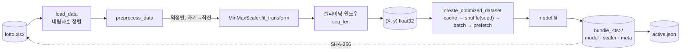

## 12. 프런트엔드 컴포넌트/상태

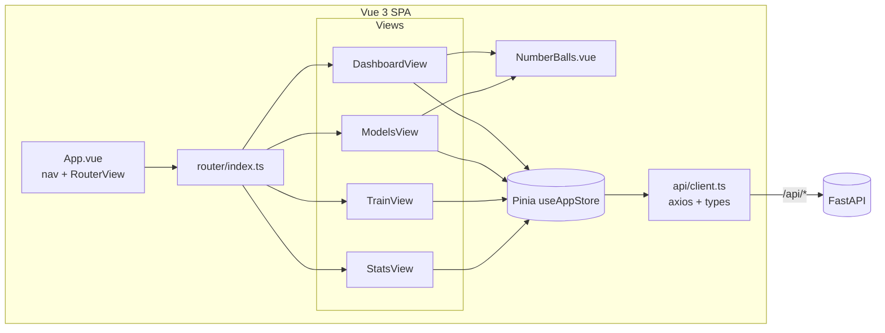

## 13. 폴링 — 학습 진행률

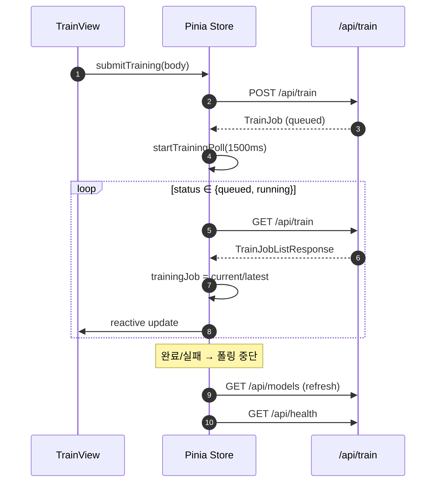
